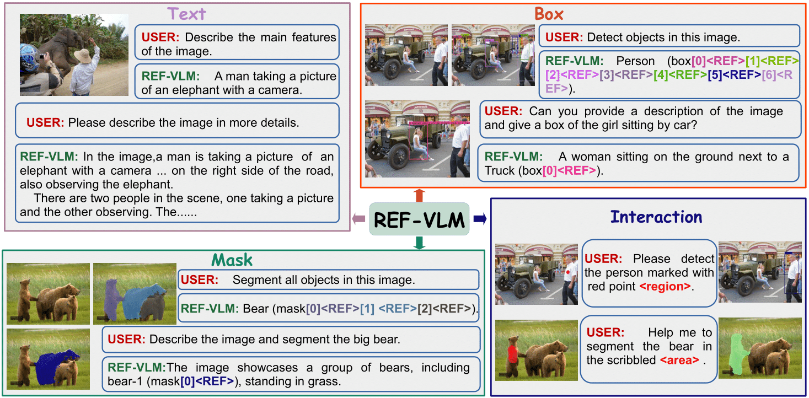

# VT-PLUG: Integrating Visual Task Plugins with Unified Instruction Tuning

<p align="center" width="100%">

</p>


 
 -----------------


Official PyTorch implementation of "[VT-PLUG: Integrating Visual Task Plugins with Unified Instruction Tuning](https://openreview.net/forum?id=a4PBF1YInZ)" [ICLR 2025 under review].

## Updates
<!-- - **28 Feb, 2024** :boom::boom: Our paper has been accepted by CVPR 2024! 🎉
- **05 Sep, 2023**: We release the code, data, and [LCL-2WAY-WEIGHT](https://huggingface.co/ISEKAI-Portal/LCL_2WAY_WEIGHT) checkpoint.
- **24 Aug, 2023**: We release the online demo at [🔗LCL-Demo🔗](http://117.144.81.99:20488/).
- **17 Aug, 2023**: We release the two subsets of ISEKAI (ISEKAI-10 and ISEKAI-pair) at [[Hugging Face 🤗]](https://huggingface.co/ISEKAI-Portal). -->

---
This repository contains the **official implementation** and **dataset** of the following paper:

> **VT-PLUG: Integrating Visual Task Plugins with Unified Instruction Tuning**<br>
> https://openreview.net/forum?id=a4PBF1YInZ
>
> **Abstract:** *Multimodal Large Language Models (MLLMs) demonstrate robust zero-shot capabilities across diverse vision-language tasks after training on mega-scale datasets. However, dense prediction tasks, such as semantic segmentation and keypoint detection, pose significant challenges for MLLMs when represented solely as text outputs. These challenges often necessitate task-specific visual decoders, leading to the underutilization of MLLMs' multi-task potential. In this work, we propose VT-PLUG, a novel framework that leverages modular visual components as scalable plugins for a variety of visual applications. During the joint training of vision-language tasks with varying prediction densities, we propose a Visual Decoding Chain-of-Thought (VD-CoT) mechanism to prevent task conflicts. VD-CoT requires the model to predict the current task's recognition entities, decoding unit type, and other specific details, while also providing learnable queries for precise decoding. Additionally, we construct VT-Instruct, a large-scale multi-task dataset containing over 100 million multimodal dialogue samples across 25 task types. Beyond text inputs and outputs, VT-Instruct incorporates various visual prompts such as point, box, scribble, and mask, and generates outputs composed of text and visual units like point, box, keypoint, and mask. The combination of different visual prompts and visual units generates a wide variety of task types, expanding the applicability of VT-PLUG significantly.*

  
## Todo

1. [x] Release the training and inference code.
2. [ ] Release the checkpoints.
3. [ ] Release the VT-Instruct dataset.
4. [x] Release the demo.

## Get Start

- [Install](#install)
- [Checkpoint](#checkpoint)
- [Dataset](#dataset)
- [Demo](#demo)

## Install
### Dependencies
1. This project is built on [Xtuner](https://github.com/InternLM/xtuner). Please refer to the official documents of these toolkits for installation guidance.
2. Dataset load is base on [detectron2](https://github.com/facebookresearch/detectron2).
3. [MMDetection]()
4. [COCO 2018 Panoptic Segmentation Task API](https://github.com/cocodataset/panopticapi)

### configure accelerate

```shell
accelerate config
```
## Dataset
Coming soon.

```text
VT-PLUG/
├── checkpoints
    ├── vicuna_7b
        ├──stage1
            ├──instances.json
            ├──refs(unc).p
        ├── stage2
        ├── hf_model
```

## Checkpoint
Coming soon.

```text
VT-PLUG/
├── checkpoints
    ├── vicuna_7b
        ├──stage1
            ├──instances.json
            ├──refs(unc).p
        ├── stage2
        ├── hf_model
```

## Demo

To launch a Gradio web demo, use the following command. Please note that the model evaluates in the torch.float16 format, which requires a GPU with at least 16GB of memory.

```shell
python demo/app.py --config /path/to/config
```

<!-- It is also possible to use it in 8-bit quantization, albeit at the expense of sacrificing some performance.

```shell
python ./mllm/demo/demo.py --model_path /path/to/lcl/ckpt --load_in_8bit
``` -->

## Train

After preparing [data](), you can train the model using the command:

### Stage1
```shell
NPROC_PER_NODE=8 xtuner train configs/train_stage1.py --deepspeed deepspeed_zero2
```

### Stage2
```shell
NPROC_PER_NODE=8 xtuner train configs/train_stage2.py --deepspeed deepspeed_zero2
```

### Stage3
```shell
NPROC_PER_NODE=8 xtuner train configs/train_stage3_keypoint.py --deepspeed deepspeed_zero2
```

## Cite

```bibtex
@inproceedings{
        anonymous2024vtplug,
        title={{VT}-{PLUG}: Integrating Visual Task Plugins with Unified Instruction Tuning},
        author={Anonymous},
        booktitle={Submitted to The Thirteenth International Conference on Learning Representations},
        year={2024},
        url={https://openreview.net/forum?id=a4PBF1YInZ},
        note={under review}
}
```
